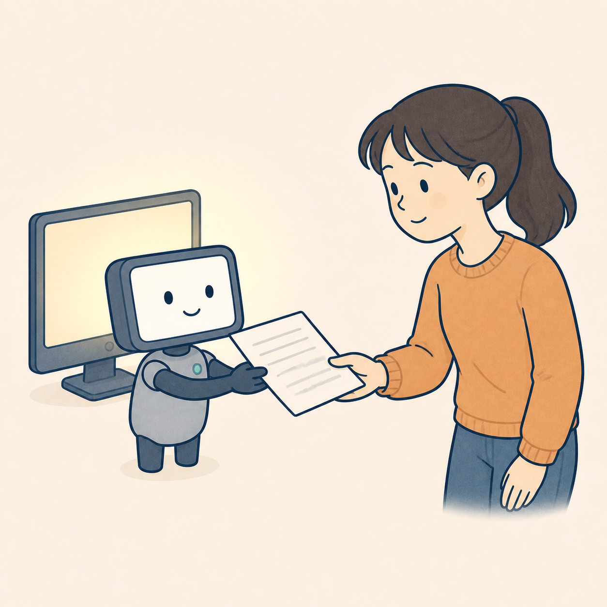

쉽게 먹는 AI 첫번째 접시

<h1>AI란? 우리가 매일 만나는 기술</h1>
<blockquote>AI를 처음 만나는 사람을 위해, 우리가 이미 일상에서 사용하고 있는 AI부터 천천히 살펴봅니다. </blockquote>

<h2>AI의 뜻부터 알아볼게요</h2>

AI는 <strong>Artificial Intelligence</strong>의 줄임말로, 우리말로는 <strong>인공지능</strong>이라고 합니다. 

인공지능은 <strong>사람의 지능이 필요한 일을 컴퓨터가 수행하도록 만든 기술</strong>입니다. 여기서 사람의 지능이 필요한 일이란 글을 이해하거나, 사진을 구분하거나, 정보를 바탕으로 판단하고 예측하는 일을 말합니다. 

Google Cloud는 AI를 컴퓨터가 언어를 이해하고, 데이터를 분석하고, 추천을 제공하는 등 과거에는 사람의 지능이 필요했던 작업을 수행하게 하는 기술로 설명합니다. <a href="https://cloud.google.com/learn/what-is-artificial-intelligence">AI의 기본 개념을 공식 설명으로 보기</a> 

다만 AI가 사람의 마음이나 생각을 그대로 갖고 있다는 뜻은 아닙니다. 컴퓨터가 사람처럼 느끼고 고민한다기보다, 많은 정보에서 패턴을 찾아 주어진 작업을 수행한다는 의미에 가깝습니다. 

<figure></figure>

<h2>AI는 이미 우리 곁에 있습니다</h2>

AI라고 하면 ChatGPT나 그림을 만들어주는 서비스를 먼저 떠올리기 쉽습니다. 하지만 AI는 그보다 훨씬 전부터 우리 주변에서 사용되고 있었습니다. 

<ul><li>동영상 서비스가 좋아할 만한 영상을 추천할 때</li><li>내비게이션이 막히는 길을 피해 경로를 안내할 때</li><li>휴대폰이 사진 속 얼굴이나 글자를 찾아줄 때</li><li>이메일 서비스가 스팸 메일을 걸러낼 때</li><li>키보드가 다음에 쓸 단어를 예상할 때</li></ul>

이 기능들의 공통점은 컴퓨터가 여러 정보를 바탕으로 일정한 <strong>판단·분류·예측</strong>을 한다는 것입니다. 

<figure></figure>

<h2>AI는 어떻게 판단할까요?</h2>

스팸 메일을 예로 들어보겠습니다. AI는 “이 메일이 싫다”고 느끼지 않습니다. 과거에 스팸으로 분류된 메일에서 자주 나타난 단어, 발신자, 문장 형태 등을 살펴보고 새 메일이 스팸일 가능성을 계산합니다. 

그래서 AI의 결과는 유용할 수 있지만 항상 맞는 것은 아닙니다. 학습한 정보가 부족하거나 새로운 상황을 만나면 결과가 달라질 수 있습니다. 

<figure></figure>

<h2>AI를 도구로 바라보기</h2>

AI는 사람을 완전히 대신하는 마법이라기보다, 사람이 더 빠르게 찾고 정리하고 시도하도록 돕는 도구에 가깝습니다. 

목적을 정하고, 결과를 확인하고, 중요한 판단을 내리는 일은 여전히 사람의 몫입니다. 

<h2>한 줄 정리</h2>

<strong>AI는 사람의 지능이 필요한 일을 컴퓨터가 수행하도록 만든 기술이며, 이미 추천·검색·자동완성 같은 모습으로 우리 일상에 들어와 있습니다.</strong> 

다음 글에서는 AI가 데이터를 바탕으로 배우는 방법인 <strong>머신러닝</strong>과, 글·이미지·코드처럼 새로운 결과물을 만드는 <strong>생성형 AI</strong>를 살펴보겠습니다. 

<h2>출처</h2>
<ul class="sources">
<li><a href="https://cloud.google.com/learn/what-is-artificial-intelligence">Google Cloud — What is Artificial Intelligence?</a></li>
<li><a href="https://ibm.com/think/topics/artificial-intelligence">IBM — What Is Artificial Intelligence?</a></li>
</ul>
